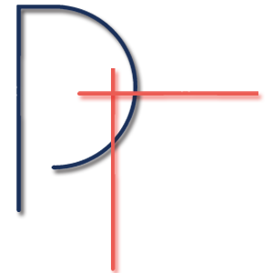

I'm Designer and Developer Priyam Tongia

<!--
[![alt text][1.1]][1]
[![alt text][2.1]][2]
[![alt text][3.1]][3]
[![alt text][4.1]][4]
[![alt text][5.1]][5]
[![alt text][6.1]][6]

[1.1]: http://i.imgur.com/tXSoThF.png (twitter icon with padding)
[2.1]: http://i.imgur.com/P3YfQoD.png (facebook icon with padding)
[3.1]: http://i.imgur.com/yCsTjba.png (google plus icon with padding)
[4.1]: http://i.imgur.com/YckIOms.png (tumblr icon with padding)
[5.1]: http://i.imgur.com/1AGmwO3.png (dribbble icon with padding)
[6.1]: http://i.imgur.com/0o48UoR.png (github icon with padding)

[1]: http://www.twitter.com/carlsednaoui
[2]: http://www.facebook.com/sednaoui
[3]: https://plus.google.com/+CarlSednaoui
[4]: http://carlsed.tumblr.com
[5]: http://dribbble.com/carlsednaoui
[6]: http://www.github.com/carlsednaoui
-->
<!--
**Priyam1418/Priyam1418** is a ✨ _special_ ✨ repository because its `README.md` (this file) appears on your GitHub profile.

Here are some ideas to get you started:

- 🔭 I’m currently working on ...
- 🌱 I’m currently learning ...
- 👯 I’m looking to collaborate on ...
- 🤔 I’m looking for help with ...
- 💬 Ask me about ...
- 📫 How to reach me: ...
- 😄 Pronouns: ...
- ⚡ Fun fact: ...
-->
